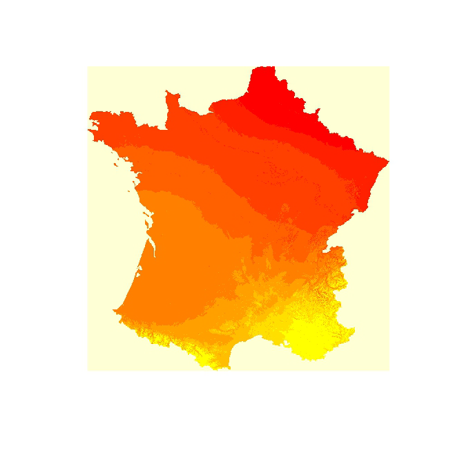

---
output:
  pdf_document:
    keep_tex: true
    fig_caption: true
    latex_engine: xelatex
    highlight: pygments
    toc: yes
    toc_depth: 5
header-includes:
  - \usepackage{xcolor}
  - \definecolor{mycolor}{HTML}{000000}
  - \color{mycolor}
fontsize : 12pt
lineheight : 1.5
title:
 $\fontfamily{century}\textbf{Agence Nationale de Statistique et de la Démographie}$ 
 \begin{center}\textbf{ANSD}\end{center}
 **------------------------------------------------------------** \newline
   $\fontfamily{century}\textbf{Ecole Nationale de la Statistique et de l'Analyse Economique}$
  \begin{center}\textbf{ENSAE Pierre NDIAYE}\end{center}
  **------------------------------------------------------------** \newline
  
  $\fontfamily{century}\selectfont\color{red}\textbf{CARTOGRAPHIE SUR R}$ \newline
  
 **------------------------------------------------------------**
  
  \begin{flushleft}
   Rédigé par :\newline
   Yatoute MINTOAMA\newline
   Richard GOZAN\newline
   Isabelle Danielle MOSSE\newline\newline
   Elèves ingénieurs statisticiens économistes
   \end{flushleft}
   
   \begin{flushright}
   Sous la supervision de :\newline
   HEMA Aboubacar\newline
   Research Analyst\newline
   \end{flushright}
date: 
  24 Juin 2023
  \newpage
---

```{r setup, include=FALSE}
knitr::opts_chunk$set(message=FALSE)
```

# \color{blue}{\textbf{Introduction}}

```{r eval=FALSE}
install.packages(c(
"cartography", # réaliser des cartes
"classInt", # discrétisation de variables quantitatives
"ggspatial", # syntaxe complémentaires à la ggplot
"GISTools", # outils pour faire de la carto
"leaflet", # interractivité avec JavaScript
"maptools", # manipulation de données "spatial",
"OpenStreetMap", # OSM
"osrm", # openstreetmap avec R
"popcircle", # représentation style bubble plot
"raster", # manipulation de données raster
"RColorBrewer", # palette de couleurs pour carto
"rgdal", # import de données spatiales
"rgeos", # manipulation de données spatiales
"sf", # nouvelle classe d'objets spatials
"sp", # ancienne classe d'objets spatials
"tidyverse", # ggplot, dplyr, etc
"tmaptools" # pour la carto
),
dependencies = TRUE)
devtools::install_github(repo = 'rCarto/photon')
```

# \color{blue}{\textbf{I. Conceptes de base de la cartographie}}

## \color{blue}{\textbf{ I.1. Système de coordonnées de référence (CRS)}}

Le système de coordonnées de référence (CRS) est un élément essentiel de la cartographie. Il définit comment les coordonnées spatiales sont représentées dans un système de référence donné, permettant ainsi de situer les objets géographiques sur la Terre.Si on possède un fichier de données spatial sans cette information, il sera difficile, voire impossible de travailler avec plusieurs sources de données.

Pour construire un CRS, il faut définir essentiellement les deux critères suivants :

• choisir une forme géométrique pour représenter la terre ;

• choisir une projection pour représenter la forme de la terre, initialement en 3D, en deux dimensions.

Sur R, pour créer un CRS on utilise la fonction *CRS()* du package *sp*. Par exemple :

```{r crs, eval=FALSE}
library(sp)
crs <- CRS("+proj=utm +datum=WGS84 +ellps=WGS84")
```

-   Le paramètre *+proj* spécifie la projection à utiliser, qui détermine comment les coordonnées géographiques sont transformées en coordonnées cartographiques.

-   *+datum* spécifie le datum géodésique, qui définit l'origine, l'orientation et l'échelle du système de coordonnées par rapport à la Terre.

-   *+ellps*, quant à lui, spécifie uniquement l'ellipsoïde de référence utilisé pour représenter la forme de la Terre.

Pour les CRS les plus connus, ceux adoptés en général par des organismes officiels, il existe un code *EPSG*. Par exemple, pour le Référentiel Géodésique Français 93, le code EPSG correspondant est le 2154. Ainsi, plutôt que d'appeler le CRS par tous les éléments qui le décrivent, on pourra utiliser son code *EPSG* :

```{r EPSG, eval=FALSE}
CRS("+epsg=2154")
```

Pour attribuer un CRS à un objet spatial existant, on peut utiliser la fonction st_crs() du package *sf* :

```{r st_crs, eval=FALSE}
library(sf)
data <- st_read("data.shp")
st_crs(data) <- crs
```

Pour convertir des données d'un CRS à un autre, on peut utiliser la fonction *st_transform()* :

```{r st_trans, eval=FALSE}
transformed_data <- st_transform(data, crs_new)
```

## \color{blue}{\textbf{I.2. Fichiers de données spaciales}}

D'un point de vue informatique, il y a deux modes fondamentaux qui permettent de distinguer les données spatiales : le mode raster et le mode vecteur. Selon le mode, les données sont stockées dans des formats différents.

### \color{blue}{\textbf{I.2.1. Le mode raster}}

Dans sa forme la plus simple, un raster est une image, autrement dit une matrice composée de pixels de même taille. A chaque pixel, on peut observer une information qualitative (par exemple, la valeur oui ou non, le type de sol urbain, forêts, prairies, etc.) ou alors une information quantitative (par exemple une altitude et dans ce cas on représente la valeur par un dégré de coloration plus ou moins fort selon le code couleur utilisé).

```{r, echo=FALSE, fig.align='center', out.width='80%'}

```

Dans ce type de données on y trouve des fichiers d'extention :

• .png ou .jpg : représentant généralement une visualisation des données raster ;

• .asc (ASCII Grid) : stocke sous forme de grille régulière, les informations sur les coordonnées spatiales des cellules, les limites du raster, la résolution et les valeurs associées à chaque cellule.

• .db : une table attributaire qui associe des informations non spatiales aux cellules du raster, telles que des noms, des valeurs, des descriptions ou d'autres attributs spécifiques.

### \color{blue}{\textbf{I.2.2. Le mode vecteur}}

Le format vectoriel utilise le concept d'objets géométriques (points, lignes, polygones) ou "Spatial Features" pour représenter les entités géographiques.Il existe plusieurs formats vectoriels possibles pour stocker des données spatiales. Nous allons décrire dans cette section les deux principaux : Shapefile et GeoJSON.

### Format shapefile

Pour ce type de fichier, les données spatiales sont stockés dans plusieurs fichiers qui portent le même nom avec des extensions différentes. Le fichier qui porte l'extension .shp contient toute l'information liée à la géométrie des unités spatiales. Il doit être nécessairement accompagné de deux autres fichiers portant l'extension :

• .dbf (dBase File): une table attributaire qui contient les attributs associés à chaque entité géographique du fichier .shp ;

• .shx (Shape Index File): un index spatial qui permet d'accéder rapidement aux données géométriques dans le fichier .shp.

### Format GSON

Il s'afit d'un format de données spatiales issu de la syntaxe JSON. Il l'avantage de contenir l'information (stockée dans un langage tout à fait compréhensible) dans un seul fichier : c'est-à-dire qu'on retrouve dans le même fichier l'information géographique sur les objets, l'information statistique observée sur ces objets et enfin le système de projection utilisé. Ci-dessous un extrait d'un fichier de ce format :

```{r json, eval=FALSE}
{"type": "FeatureCollection",
"crs": {"type": "name", "properties": {"name": "EPSG:26904"}},
"features": [
{"type": "Feature",
"properties": {
"name": "Van Dorn Street",
"marker-color": "#0000ff",
"marker-symbol": "rail-metro",
"line": "blue"},
"geometry": {
"type": "Point",
"coordinates": [
-77.12911152370515,
38.79930767201779
]}
}]
}
```

### \color{blue}{\textbf{I.2.3. Le format de données spatiales Geopackage}}

Le format de données spatiales Geopackage est un format de base de données géospatiales qui combine à la fois les données vecteur et raster. Il a été développé comme un standard ouvert par l'Open Geospatial Consortium (OGC) et est largement utilisé dans le domaine de la géomatique.

Geopackage est conçu pour stocker des ensembles de données spatiales avec une structure organisationnelle hiérarchique. Il utilise une seule base de données SQLite pour stocker à la fois les données géospatiales et les attributs associés. Cela permet de stocker plusieurs couches de données (point, ligne, polygone, raster, etc.) dans un seul fichier, ce qui facilite le partage et la distribution des données.

### \color{blue}{\textbf{I.2.4. Où trouver des fichiers de données spatiales “Open Data” ?}}

Ci-dessous une liste non exhaustive de liens où il est possible de télécharger des fichiers de données spatiales "Open Data" dont on utilisera une partie dans la suite de cet eexposé :

• Les contours administratifs par pays : le site <https://www.gadm.org/> présente une liste exhaustive de fonds de cartes présentant les contours administratifs de la plupart des pays du globe. Le découpage est fait en plusieurs niveaux allant du contours du pays jusqu'aux contours des communes.

• l'IGN propose de télécharger gratuitement un certain nombre de données françaises portant sur les axes routiers, l'hydrographie, l'altitude, la localisation d'exploitation agricole, le découpage de la France en iris (qui est un sous-découpage des communes en France), etc. Pour accéder à ces données : <https://geoservices.ign.fr/documentation/diffusion/telechargement-donnees-libres.html>

• Le site de la "Natural Earth" (<http://www.naturalearthdata.com/>) propose de télécharger un certain nombre de données écologiques à l'échelle planétaire.

• Les données libres américaines diffusées par le gouvernement américain (www.data.gov), la version européenne (data.europa.eu/euodp) et la version française (<https://www.data.gouv.fr/fr/>) dont de nombreuses bases sont géoréférencées.

• La SNCF diffuse de nombreuses bases de données en libre accès : <https://data.sncf.com/explore/?sort=modified>

# \color{blue}{\textbf{II. Lecture et manipulations des données spaciales sur R}}

## \color{blue}{\textbf{II.1. Passage des données non spaciale à des données de la classe "Spaciale"}}

Commençons par importer des données classiques, c'est-à-dire dans un format non spatial, par exemple auformat texte .csv. Pour importer ces données sous R :

```{r}
seisme_df <- read.csv2("Donnees/earthquake/earthquakes.csv")
head(seisme_df, 2) 
```

Dans la suite, nous présenterons les deux solutions (*sp* et *sf*) simultatément

### \color{blue}{\textbf{II.1.1. La classe sp}}

Pour passer d'un objet de classe data.frame, à un objet de classe "Spatial" sp, il suffit d'utiliser la fonction *coordinates()* et de préciser avec le symbole *\~* quelle sont les variables de géolocalisation. Par exemple :

```{r}
library(sp)
seisme_sp <- seisme_df
coordinates(seisme_sp) <- ~Longitude + Latitude
class(seisme_sp) 
```

Dans ce cas, comme les objets géographiques correspondent à des points, la classe d'objet est la classe SpatialPointsDataFrame. Les deux autres classes d'objets étant SpatialLinesDataFrame (pour les objets de type ligne brisée comme les routes) et SpatialPolygonsDataFrame (pour les objets de type polygone comme les contours administratifs)

Pour afficher quelles sont ces attributs, on peut utiliser la fonction *str()*

```{r}
str(seisme_sp) 
```

Pour accéder aux différents élements qui constituent ce type d'objet, on utilise le symbole \*\*@*\*. Par exemple:

```{r}
head(seisme_sp@data, 2) 
```

```{r}
head(seisme_sp@coords, 2) 
```

### \color{blue}{\textbf{II.1.2 La classe sf}}

Pour transformer un objet de classe data.frame (ou alors de type "Spatial", c'est-à-dire SpatialPoints.DataFrame, SpatialLinesDataFrame ou SpatialPolygonsDataFrame) en objet de classe sf, on utilise la fonction *st_as_sf()* de la manière suivante :

```{r}
library(sf)
seisme_sf <- st_as_sf(seisme_df, coords = c("Longitude", "Latitude"))
class(seisme_sf) 
```

La structure de cet objet est comme celle d'un data.frame auquel on a ajouté une colonne geometry propre à l'information spatiale :

```{r}
head(seisme_sf)
```

Pour travailler uniquement sur le jeu de données et exclure les géométries, on utilise la fonction *st_drop_geometry()*

```{r}
head(seisme_sf %>% st_drop_geometry(), 2)
```

Pour changer le CRS, on utilise la fonction *st_crs()* :

```{r}
st_crs(seisme_sf) <- 4326
```

## \color{blue}{\textbf{II.2. Importation et exportation des données spaciales}}

### \color{blue}{\textbf{II.2.1. Importation}}

### Mode vecteur

On va importer le jeu de données qui contient les contours administratifs des pays (donc des polygones) connus sur Terre. Il s'agit d'un fichier Shapefile. Nous allons voir les deux façons d'importer ces données selon qu'on choisit la classe sp ou bien la classe sf

a)  Classe sp

Nous utilisons la fonction "readOGR()" issu du package "rgdal" qui permet d'importer les types de données spatiales:

```{r}
library(rgdal)
world_sp <- readOGR(dsn = "Donnees/World WGS84",
layer = "Pays_WGS84")
```

Dans le cas de polygones, l'objet spatial est un SpatialPolygonsDataFrame. Pour analyser sa structure,on extrait ici une seule observation (on procède de la même façon qu'on fait avec un data.frame) :

```{r}
str(world_sp[53, ])
```

On retrouve pratiquement les mêmes attributs que pour un objet SpatialPointsDataFrame exceptés les attributs polygons et plotOrder

On va essayer d'aller un peu plus loin dans l'analyse d'un tel objet

```{r}
str(world_sp[53, ]@polygons[[1]])
```

On constate qu'il s'agit d'un objet de classe Polygons et que celui est constitué de 5 attributs.

b)  Classe sf Nous pouvons utiliser la fonction st_read() qui permet de lire de nombreux types de fichiers spatiales. Nous allons importer des fichiers shapefile et geopackage

• Fichier shp

```{r}
world_sf <- st_read("Donnees/World WGS84/Pays_WGS84.shp")
```

Les coordonnées des polygones sont stockées dans la colonne geometry :

```{r}
head(world_sf)
```

Pour accéder à la géométrie :

```{r}
str(st_geometry(world_sf[53, ]))
```

• fichier gpkp

Les lignes suivantes importent 2 couches dans le fichier geopackage lot46.gpkg

```{r}
dep <- st_read("Donnees/geodata-main/data/lot46.gpkg", layer = "departement", quiet = TRUE)
route <- st_read("Donnees/geodata-main/data/lot46.gpkg", layer = "route", quiet = TRUE)
com <- st_read("Donnees/geodata-main/data/lot46.gpkg", layer = "commune")
```

### Mode raster

Pour importer les données raster sous R, nous pouvons utliser la fonction *raster()* issu du package *"raster"*

```{r}
library(raster)
wind <- raster("Donnees/wind/FRA_wind-speed_200m.tif")
```

### \color{blue}{\textbf{II.2.2. Exportation}}

La fonction *st_write()* d'exporter de nombreux types de fichiers.

La ligne suivante exporte l'objet dep dans un dossier data au format shapefile.

```{r}
st_write(obj = dep, "Donnees/data/dep.shp", 
         layer_options = "ENCODING=UTF-8", 
         delete_layer = TRUE)
```

La ligne suivante exporte l'objet world_sf dans un dossier data au format GeoJSON

```{r eval=FALSE}
st_write(world_sf, "Donnees/data/world_json.json", 
         driver = "GeoJSON")
```

## \color{blue}{\textbf{II.3. Manipulations d'objets de type "Spatial"}}

Pour chacune des trois classes d'objets vues ci-dessus, il existe un certain nombre de fonctions qui peuvent y être appliquées. Pour connaître ces fonctions :

```{r}
methods(class = "Spatial")
```

```{r}
methods(class = "sf")
```

```{r}
methods(class = "raster")
```

### \color{blue}{\textbf{II.3.1. Fonctions de base}}

Pour connaître le nombre d'observations et le nombre de variables, on utilise la fonction dim() (dans le cas de la norme sf, la géométrie compte pour une variable) :

```{r}
dim(world_sp)
```

```{r}
dim(world_sf)
```

Pour changer le nom des observations, on utilise row.names() :

```{r}
row.names(world_sp) <- as.character(world_sp@data$NOM)
```

### \color{blue}{\textbf{II.3.2. Sélection d’observations}}

Pour sélectionner un sous-échantillon, on utilise la même syntaxe que pour les data.frame dans le cas de la norme sp :

```{r}
uemoa_sp <- world_sp[c("Benin", "Burkina Faso",
                       "Guinea-Bissau","Ivory Coast", 
                    "Mali", "Niger", "Senegal", "Togo"),]
```

Pour la classe sf, on peut utiliser la même syntaxe que pour sp, mais en plus, on peut utiliser la syntaxe à la mode dplyr.

```{r}
library(tidyverse)
uemoa_sf <- world_sf %>%
  filter(NOM %in% c("Benin", "Burkina Faso", "Guinea-Bissau",
                    "Ivory Coast", "Mali",
                    "Niger", "Senegal","Togo"))
```

### \color{blue}{\textbf{II.3.3. Représentations de cartes de base}}

On utilise la fonction plot() qui appliquée à un objet "Spatial" va seulement représenter la géométrie de l'objet. On peut ensuite utiliser les fonctions graphiques de base (title(), legend(), etc.) pour ornementer le graphique

```{r}
plot(uemoa_sp, col = c("azure","cyan","gold","gray",
                    "lawngreen", "pink3","tomato","violet"))
title("Pays de l'UEMOA")
legend("topright", 
       legend = row.names(uemoa_sp),
       cex = 0.4, title = "Nom des pays", 
       fill = c("azure","cyan","gold","gray",
      "lawngreen","pink3","tomato","violet"))
```

Pour la norme sf, le principe est différent. En effet, une carte par variable sera automatiquement représentée.Dans cet exemple, le jeu de données ne contient qu'une seule variable et par conséquent une seule figure est représentée. Pour ne sélectionner que la géométrie, il aurait fallu faire appel à la fonction st_geometry().

```{r}
plot(uemoa_sf, main = "Pays de l'UEMOA")
```

### \color{blue}{\textbf{II.3.4. Aggrégation des données}}

Pour aggréger des données spatiales, il y a deux contraintes :

1.  faire l'aggrégation sur les objets spatiaux : par exemple deux polygones contigus vont fusioner pour n'en former plus qu'un seul.

2.  faire l'aggrégation sur les variables. Dans ce cas-là, il est important de tenir compte de la nature des variables à aggréger

On va ici réaliser ces deux étapes avec la norme "Spatial" à la suite. Pour fusionner les objets spatiaux, on utilisera la fonction *unionSpatialPolygons()* incluse dans le package maptools. L'argument IDs contient un vecteur de la même taille que la table initiale où chaque élément correspond au nom de l'observation dans la nouvelle table. Par exemple, pour fusionner le "Benin" et le "Togo", sachant que le Benin et le Togo sont les éléments 1 et 8 de la table initiale, on fera :

```{r}
library(maptools)
uemoa_sp_new <- unionSpatialPolygons(uemoa_sp,
              IDs = c("Benin", "Burkina Faso",                                   "Guinea-Bissau", "Ivory Coast", "Mali",
                    "Niger", "Senegal", "Benin"))
   
```

L'objet créé, de classe SpatialPolygons ne contient que la géométrie des observations et pas de data.frame. On va donc créer un nouveau jeu de données avec les mêmes observations.

```{r}
uemoa2.df <- data.frame(NOM = c("Benin", "Burkina Faso",
                       "Guinea-Bissau", "Ivory Coast", 
                       "Mali", "Niger", "Senegal"),
  pib = c(14954,16686,1458,59221,16183,12609,23354),
  pop = c(12996,22100,2060,27478,21904,25252,16876),
  region = rep("O", 7))
row.names(uemoa2.df) <- uemoa2.df$NOM
```

Enfin, on associe les géométries au jeu de données en utilisant la fonction *SpatialPolygonsDataFrame()*

```{r}
uemoa_sp_new <- SpatialPolygonsDataFrame(
  uemoa_sp_new, uemoa2.df)
class(uemoa_sp_new)
```

Pour aggéger les données spatiales de type sf, on peut aussi utiliser la syntaxe dplyr. Ici, on aggrége d'abord les entités spatiales et on applique ensuite la fonction merge() :

```{r}
uemoa_sf_new <- uemoa_sf %>% group_by(
  NOM = c("Benin", "Burkina Faso", "Guinea-Bissau",
  "Ivory Coast", "Mali","Niger", "Senegal", "Benin")) %>%
  summarise() %>%
  merge(uemoa2.df, by = "NOM")
class(uemoa_sf_new)
```

### \color{blue}{\textbf{II.3.5. Ajout de données spatiales}}

Pour pouvoir ajouter une unité spatiale à un objet "Spatial", il faut que les deux objets aient les mêmes attributs (i.e. les même variables). Par exemple, pour ajouter les pays de la ZMOA aux données précédentes, on créée d'abord un objet "Spatial" :

```{r}
zmoa_sp <- world_sp[c("Gambia, The", "Ghana", "Guinea",
    "Liberia", "Nigeria", "Sierra Leone"), ]

zmoa_df <- data.frame(NOM = c("Gambia, The", "Ghana",
  "Guinea", "Liberia", "Nigeria", "Sierra Leone"),
   pib = c(1719,66882,13606,2965,452971,3505),
   pop = c(2639,31394,13531,5193,213401,8141), 
  region = rep("O", 6))
zmoa_sp <- merge(zmoa_sp, zmoa_df, by = "NOM")
row.names(zmoa_sp) = c("Gambia", "Ghana", 
  "Guinea", " Liberia", " Nigeria", "Sierra Leone")
```

On utilise ensuite la fonction *spRbind()* (analogue de la fonction rbind())

```{r}
westAf_sp <- spRbind(uemoa_sp_new, zmoa_sp)
plot(westAf_sp, col =
        c("skyblue","cyan","gold","sienna","lawngreen",
        "pink3","tomato","violet","red1","rosybrown",
        "snow4","yellowgreen","magenta2"))
```

Nous ajoutons le cap vert pour former la CEDEAO:

```{r}
capvert_sp <- world_sp["Cape Verde", ]
capvert_df <- data.frame(NOM = "Cape Verde", pib = 1784, 
                        pop = 587925, region = "O")
capvert_sp <- merge(capvert_sp, capvert_df, by = "NOM")
row.names(capvert_sp) = "Cape Verde"
cedeao_sp <- spRbind(westAf_sp, capvert_sp)
```

Nous affichons la carte de la CEDEAO:

```{r}
plot(cedeao_sp)
plot(cedeao_sp, border = NA, col = "NA", bg = "#A6CAE0")
plot(world_sp, col = "wheat", border = NA, add = T)
plot(cedeao_sp, col = "yellow2", border = "tomato", add = T)
```

Le principe est le même avec la classe sf sauf que la fonction s'appelle rbind() et qu'on peut continuer à utiliser la syntaxe dplyr :

```{r}
zmoa_sf <- world_sf %>% filter(
        NOM %in% c("Gambia, The", "Ghana", "Guinea",
                    "Liberia", "Nigeria", "Sierra Leone"))

zmoa_sf <- merge(zmoa_sf, zmoa_df)
westAf_sf <- uemoa_sf_new %>% rbind(zmoa_sf)
```

Ajout du cap vert:

```{r}
capvert_sf <- world_sf[world_sf$NOM == "Cape Verde", ]
capvert_sf <- merge(capvert_sf, capvert_df)
cedeao_sf <- westAf_sf%>%
  rbind(capvert_sf)
```

### \color{blue}{\textbf{II.3.6. Représenter une étiquette}}

La fonction *mf_label()* du package *mapsf* est dédiée à l'afichage d'étiquettes

```{r}
library(mapsf)
mf_map(uemoa_sf)
mf_label(
  x = uemoa_sf,
  var = "NOM",
  col= "black",
  halo = TRUE,
  overlap = FALSE, 
  lines = FALSE
)
mf_scale()
```

### \color{blue}{\textbf{II.3.6. Afficher plusieurs cartes sur la même figure}}

Il faut ici utiliser l'argument mfrow de la fonction *par()*. Le premier chiffre représente le nombre lignes et le deuxième le nombre de colonnes

```{r}
par(mfrow = c(1, 2))
# first map
mf_map(uemoa_sf)
mf_title("Carte de l'UEMOA")
# second map
mf_map(cedeao_sf)
mf_title("Carte de la CEDEAO")
```

### \color{blue}{\textbf{II.4. Manipulations des données de type raster}}

Voir script R

## \color{blue}{\textbf{III. Etude de cas}}

Voir script R
